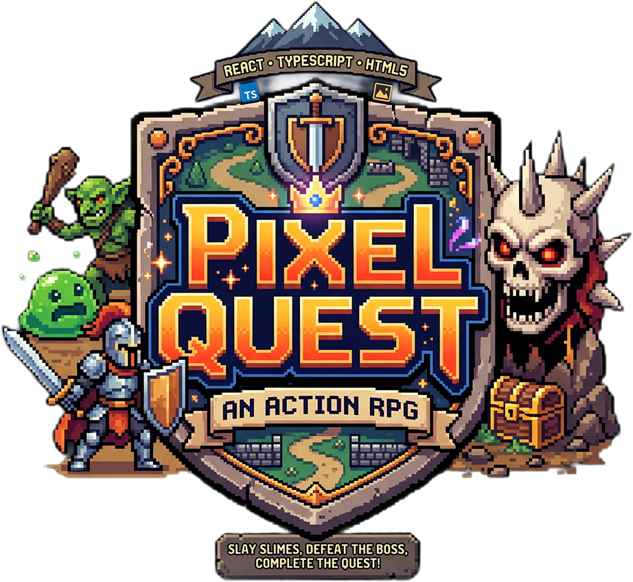

<div align="center">
  
  <h1>PixelHero</h1>
  <p><strong>An action-packed 2D top-down RPG built entirely in React, TypeScript, and HTML5 Canvas.</strong></p>
  
  <p>
    
    
    
    
  </p>
</div>

---

Embark on an epic quest in a retro-inspired world, battle dangerous creatures, collect powerful upgrades, and defeat the Shadow Warden! PixelHero is a complete game engine running entirely on the web, bypassing standard DOM nodes in favor of a highly-optimized `requestAnimationFrame` Canvas renderer.

## Features

- **Action RPG Combat**: Real-time hack-and-slash combat with dashing, attacking, invincibility frames, and hit-stun mechanics.
- **Dynamic Entities**: 9 unique enemy types including slimes, bats, goblins, scorpions, wraiths, skeletal knights, and 3 distinct bosses (Gruk, Sand Wyrm, Shadow Warden) with custom AI.
- **Quest System**: Talk to NPCs and complete a 4-phase linear progression of 11 quests.
- **Expansive Zones**: Travel between 5 distinct environments:
  - Emberwick (Safe Zone)
  - Gloomwood
  - Scorched Wastes
  - Hollow Depth
  - Abyssal Sanctum (Features a 3-wave gauntlet)
- **Loot & Leveling**: Gain XP, level up your stats, visit the merchant, and collect coins, hearts, and relics.
- **New Game+**: Replay with scaled difficulty (Enemies +50% HP, +30% Damage), while retaining your perks and upgrades.
- **Procedural Audio**: 3 distinct, procedural MIDI-like music themes (Desert, Dungeon, Sanctum) and synthesized sound effects.
- **Responsive Controls**: Keyboard and touch-joystick support.
- **Modern Tech Stack**: React 19, Vite, TailwindCSS, and TypeScript.

## Setup Instructions

1. **Clone the repository** (if you haven't already):
   ```bash
   git clone <your-repo-url>
   cd PixelHero
   ```

2. **Install dependencies**:
   ```bash
   npm install
   ```

3. **Start the development server**:
   ```bash
   npm run dev
   ```

4. **Open in Browser**:
   Navigate to `http://localhost:5173` (or the port Vite provides) to play the game!

## Usage & Controls

- **Movement**: `W` `A` `S` `D` or `Arrow Keys`
- **Attack**: `Space`, `J`, or `K`
- **Dash**: `Shift` or `L`
- **Interact / Talk**: `E` or `F`
- **Pause Game**: `Escape` or `P`
- **Quest Log**: `Q`
- **Instant Restart**: `R`

## Documentation

For detailed insights into the project, check out the `docs/` folder:

- [Project Structure](docs/PROJECT_STRUCTURE.md)
- [Architecture & Flow](docs/ARCHITECTURE.md)
- [Key Components](docs/COMPONENTS_AND_FLOW.md)
- [Internal API Reference](docs/API_REFERENCE.md)
- [Onboarding](docs/ONBOARDING.md)
- [Environment Configuration](docs/ENVIRONMENT.md)

## Contribution Guidelines

We welcome contributions! Please see our [CONTRIBUTING.md](CONTRIBUTING.md) for details on how to get started. Whether it's adding a new enemy, zone, or fixing a bug, your help is appreciated.

## License

This project is licensed under the MIT License. See the [LICENSE](LICENSE) file for details.
